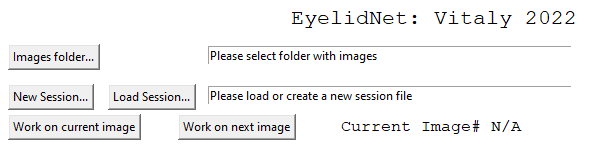

# EyelidNet
## Vitaly Lerner , 2022

The purpose of this project is to generate sets of images with traced eyelids. 

# Installation
The main file is EyelidNet_Manual.py
The following packages are required:
- numpy
- tkinter
- matplotlib
## Separate environment with anaconda
If needed, create a separate python environment (let's call it `eyelid`) to prevent version interference with other programs

1. Open  Anaconda Prompt 
2. `conda create -name eyelid python=3.8 numpy  matplotlib`
3. `conda activate eyelid`
4. `conda install numpy matplotlib`
5. `conda install -c conda-forge tk`

## simple installation of packages with pip/conda
Just install tkinter with 
- `conda install matplotlib`
- `conda install numpy`
- `conda install -c conda-forge tk`

or with

- `pip install numpy matplotlib`
- `pip install tk`

# Marking eye lids with the program
1. Run the program by 
`cd <path to the the directory with EyelidNet_manual.py>`
1. `python EyelidNet_manual.py`

1. Download the images (P1,P2,P3) and put them in a certain folder *<path_to_folder>*
1. Press **Images folder...** and navigate to the *<path_to_folder>*
1. If first time, press "New Session" and create a session file, preferably not in the *<path_to_folder>*
1. Press **Work on current Image**
1. Select 8 points as shown here . **!!!ORDER MATTERS!!!** 
points 1-2-3-4-5 describe the upper eyelid  LTR and points 5-6-7-8-1 describe  the lower one RTL
. 
**Exact location of inner points(2,3,4,6,7,8) is not critical, any three inner points are good enough**. At the next stage, description by points will be later converted to polynomial approximation of 3rd order. But limiting points, 1 and 8 are more important.
How to work with the mouse:
- Left click to select a point, 
- Right click for "undo"
- Do not press the middle button
- **If zoom in needed, right click after the zoom in, otherwize, a point will be created at the top left corner of the zoom region**
1. If you're satisfied with the result shown on the main window, click "Work on Next Image"
Otherwise, repeat the current image with **Work on current Image**
1. If you're tired, just close the window
1. To continue from the point of the break, open the program, and instead of **New Session**, use **Load Session**

# Finilizing the result
The results will be stored in the session file. This is a csv file. Please upload it/send it by email.
